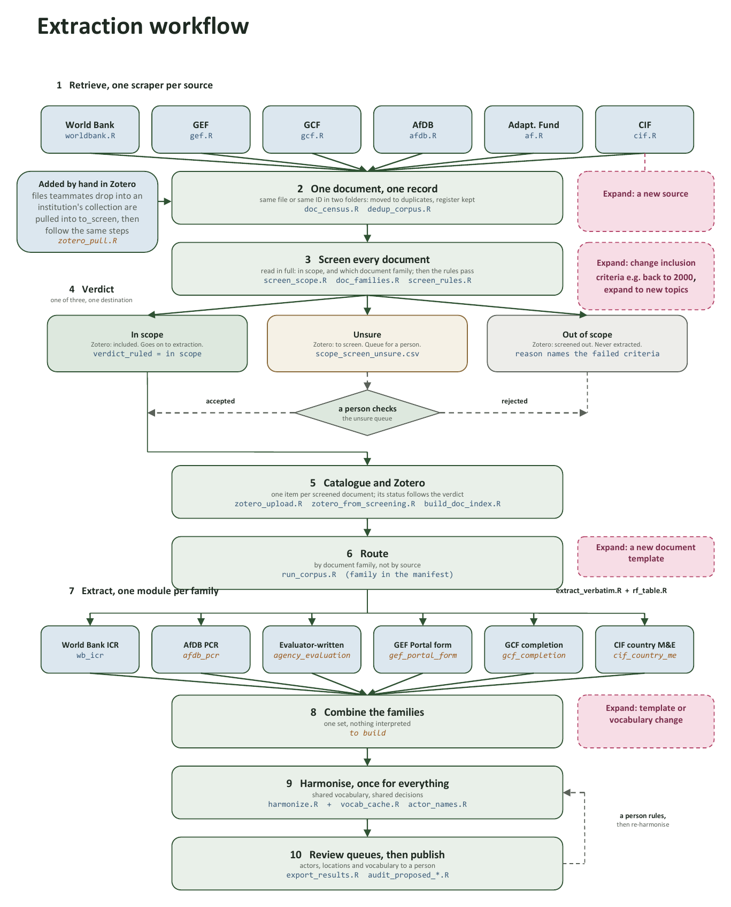

# AI-Assisted Data Extraction from Project Evaluation Documents

**Protocol for corpus construction, structured extraction and validation**

Adaptation Insights, WP2 Evidence Synthesis, Grey Literature

**Version 0.2, September 2026**

> Canonical text: GitHub `Mlolita26/Adaptation-Insights`, file
> `docs/AI_Extraction_Protocol.md`. The code described here is in the same
> repository. Its README explains every script.

---

## 1. Purpose

Evidence on climate adaptation in Africa's food and agriculture sector sits
in the grey literature of development institutions: completion reports,
terminal evaluations, performance evaluations. Existing syntheses rely on
peer reviewed papers and miss this evidence (see the review protocol
`AIs_WP3_EvidenceSynthesis_GreyLit.docx`).

The WP2 grey literature synthesis builds a structured database from these
documents: what was implemented, by whom, where, and with what results.
Reading hundreds of documents by hand is too slow. A pipeline assisted by
language models applies the extraction template at scale. This protocol
defines how the corpus is built, how the data is extracted, and how the
results are checked. The pipeline is written in R and the code is public.

## 2. Objectives

1. **Build the document library.** Retrieve evaluation documents from
   institutional sources. Remove duplicates. Screen every document against
   the scope rules. Record every decision. Store the documents on OneDrive
   and catalogue them in Zotero.
2. **Fill the working database.** For every in scope document, produce
   checked records in the extraction template: one project record and
   location records in long format (one row per location, intervention and
   result).
3. **Record what could not be extracted.** A field with no evidence in the
   document stays empty, with a reason. It is never guessed.
4. **Test the template.** Values that fit no option, fields that stay empty
   and definitions that prove ambiguous are logged for the template owner.

## 3. Corpus

### 3.1 Sources

Six funders: the World Bank, the Global Environment Facility (GEF), the
Green Climate Fund (GCF), the African Development Bank (AfDB), the Adaptation
Fund and the Climate Investment Funds (CIF). Their document repositories can
be read by a program. Annex D records, per source, which classification
systems the site offers, which categories are selected and which filters run
in code.

The WP3 protocol's wider source universe (multilateral development banks, UN
agencies such as IFAD, FAO and UNDP, African government agencies, INGOs,
knowledge portals, evaluation offices) is the roadmap for extension. A new
source joins by the procedure in section 3.5.

### 3.2 Retrieval

One scraper per source downloads evaluation type documents for African
agriculture or adaptation projects and writes a metadata list. Retrieval is
generous on purpose. Documents with evidence on either angle are kept.
Stricter filters at query time were tested and lost in scope projects. The
scope decision is taken later, on the full text, by the screener (section
3.4).

Two more routes bring documents in:

- **By hand.** A team member drops a PDF into the funder's collection in the
  Zotero group library. A script lists files that have no record behind
  them, downloads them into the funder's `to_screen` folder and registers
  them. They then follow the same steps as every other file.
- **Reserve.** Candidate documents with weak evidence are catalogued but not
  downloaded. If the thematic scope widens, this reserve is the first pool
  to revisit.

Proposal stage documents (funding proposals, appraisal documents, project
documents, concept notes) are parked at retrieval and not screened. A
proposal describes an intention, not what was done.

### 3.3 One document, one record

Before screening, every file gets a census row: its document family
(section 6), its kind (terminal evaluation, mid term review, completion
report), the project and report identifiers printed on its first pages, and
a checksum.

The dedup step finds identical files and the same document filed twice
(same family, same kind, same identifier). The extra copies are moved out of
the source folders into `03_Documents/duplicates/`, renamed with their
source as prefix. An Excel register there says which copy was kept, why,
and where the other went. The kept copy is the funder's own version, then
the copy in an in scope folder, then the longer file. Nothing is deleted.

A project with several distinct documents (a mid term review and a terminal
evaluation, say) is not a duplicate. Such clusters are listed in
`project_clusters.csv` so that the merge step (section 7, phase 6) keeps one
record per project.

### 3.4 Screening

The screener reads each document in full and returns a verdict with its
evidence:

- the verdict: in scope, out of scope or unsure;
- the reason, one sentence naming the criterion that failed;
- a quote naming the climate risk the project responds to, and a quote
  describing the adaptation action;
- the document kind as the document states it, the publication year, the
  language, the countries, whether the document covers several projects,
  and whether the project is adaptation, mitigation or neither;
- the document family, confirmed or corrected against the census rule.

The five criteria, applied in this order:

| Criterion | In scope when |
|---|---|
| Source type | The document evaluates what was done: a completion report, a terminal or mid term evaluation, a performance evaluation. Proposals, appraisals and progress reports are out. |
| Timeframe | The document is dated 2015 to 2025. |
| Scope | The project is in Africa. Regional and multi country projects count if African countries are among them. |
| Sector | Agriculture and food systems are the project's primary subject: crops, livestock, fisheries, agroforestry, food security, rural livelihoods built on farming. A project in another sector is out even if farmers benefit. |
| Intervention | The project acts on a climate risk it names. Irrigation, value chains or productivity alone are not adaptation. A climate risk must be quoted. Mitigation only projects and emergency relief after a disaster are out. |

A second pass in code checks the model's answer:

- the year window is applied from the model's stored verdict, so a change
  of window is a change of two numbers and a rerun, with no document read
  again;
- in scope with no climate risk quoted becomes unsure;
- a project the model itself calls mitigation goes out;
- a programme evaluation covering several projects becomes unsure, because
  extraction needs one project to focus on;
- a bare one word reason is re asked;
- documents of one project with conflicting verdicts are listed.

A person's decision wins over all of this. The overrides file holds one row
per decided document: source, file name, verdict, note, who decided. The
rules pass applies it last. An unsure document goes to a person. The person
accepts or rejects it, the decision is recorded in the overrides file, and
the next run of the rules and of the Zotero sync carries it through.

Every decision is kept beside the model's original verdict. Every screened
document sits in a Zotero collection that shows its verdict. A new
criterion means a rerun of the rules and the sync. Nothing is lost.

### 3.5 Adding a source

Every new source joins by the same path:

1. **Retrieval.** A scraper following the repository pattern, or manual
   download.
2. **Folders.** The source's folders are added to `paths.R`, the one file
   that knows the layout.
3. **Census and dedup.** Every file is classified into a family and copies
   are removed.
4. **Screening.** Every file is judged by the screener and the rules pass.
5. **Catalogue.** The metadata list goes to the source's `List` folder,
   mirrored in the repository. The Zotero sync creates the records.
6. **Family check.** If the documents are written in a template the
   pipeline has not seen, a family is added and, if needed, an extraction
   module.
7. **Capped validation.** A small batch is extracted and reviewed against
   the section 8 metrics before the source is scaled.

### 3.6 Other inputs

- **Template:**
  `EvidenceSynthesis_GreyLiterature_AfricanAgricultureAdaptation_UpdatedTemplate_27Aug2026.xlsx`
  in `02_Template`. Its readme sheet is the data dictionary: every field
  has a description, options, examples from project P001 and extraction
  instructions. Extractions declare the template version they follow.
- **Keyword taxonomy:** the review's keyword file informs the retrieval
  filters and the vocabulary synonyms.
- **Gold set:** projects P001 to P010, extracted by hand and then audited
  page by page against the documents. Documents in
  `03_Documents/pilot/gold_set_P001-P010/`. Reference in
  `catalogues/gold_v1_general.csv` and its companions. Prompts may be tuned
  against this set.
- **Holdout set:** ten corpus documents (H001 to H010), all six sources,
  two in French, never used in tuning. An independent reference was
  extracted by reading them before the pipeline ran
  (`catalogues/holdout_reference.csv`).

## 4. Data management

Three pillars, each with one job:

| Pillar | Location | Holds | Kept in step by |
|---|---|---|---|
| **OneDrive** | `WP2_Evidence Synthesis/Grey Literature/` | The documents (`03_Documents`, one folder per source, plus `pilot/` and `duplicates/`); protocol and template (`01_Protocol`, `02_Template`); outputs for people (`04_Extraction_Results`); the knowledge base (`00_Knowledge`) | The scripts read and write here |
| **Zotero** | Group library "Adaptation Insights 2" | One record per screened document, with metadata, the file attached, and a place in its funder's `included`, `to screen`, `screened out` or `duplicates` collection | `zotero_upload.R`, idempotent, run after every screening change |
| **GitHub** | `github.com/Mlolita26/Adaptation-Insights` | All code; the metadata mirrors and reference tables (`catalogues/`); this protocol. No PDFs, no keys | Commit and push |

**Folders inside a source.** Each source has `Docs/` with an in scope
working folder, parked folders (`to_screen`, `screened_out`, `pre_2015`,
`proposal_stage`, `undated`) and `List/` for its metadata. The folder shows
where a file was put at retrieval. The decision that counts is the
screening verdict. The extraction driver takes any file judged in scope,
wherever it sits, and never takes one judged out.

**Zotero fields.** Report Number holds the document's own number where the
funder gives one. Call Number holds the project identifier (World Bank P
code, GEF id, AfDB project code, GCF FP code). Extra holds the file name
and the screening verdict with its reason. Tags carry the family, the
verdict and an internal document tag that lets the sync recognise its own
records.

**Hand additions.** Before creating a record, the sync looks for a hand made
item that is the same document (shared identifier, same URL or same file
checksum) and adopts it. The pipeline's tags and status are added; the
member's own tags and notes are kept. A bare file with no record is pulled
into the corpus (section 3.2) and, once screened, placed under the record
made for it. The pipeline deletes nothing from the library.

**Outputs.** Working files of every run stay in `05_Pipeline/outputs/`, not
tracked in git. Copies for people go to `04_Extraction_Results/`: results
workbooks, review lists, scores, costs. Nothing overwrites the hand curated
working database. Merging is a reviewed step (section 7, phase 6).

**Conventions.** Document file names carry source, project code, document
type and year. Every catalogue row keys on the source's own document
identifier. Paths are kept under 240 characters where possible; the scripts
handle longer ones.

## 5. Data model

The template defines two linked tables. Its readme sheet is the authority on
every field.

**`project_data_general`**, one record per project: identity
(`project_code`, `project_title`, `project_id`, `project_lead`); years
(publication, start, closure; actual, not planned); `project_scale`;
location count and notes; project rationale; target beneficiary;
`GESI_project` (gender and social inclusion); up to three headline results
(value, metric, unit); budget, disbursed and currency; `funding_mechanism`
and `funding_mechanism_portion`; funder and implementor as actor codes;
`document_type`; `resource_id`; `evidence_depth`; `reference_link_1` to
`3`.

**`project_data_location-specific`**, long format, one record per location,
intervention and result: location code; `subsector_stated` and coded
`subsector type`; `intervention_stated`; `rationale_stated`;
`target_beneficiary`; result (`result_stated`, `result_value`,
`result_unit`, coded `result_level`); evidence (`evidence_methodology`,
`evidence_source`); `resource_id`; `evidence_depth`; `resource_link`;
notes. At this level only `subsector type`, `result_level` and
`target_beneficiary` are coded. Everything else is verbatim.

Rules the pipeline enforces:

- **Coded and stated pairs.** Nearly every coded field pairs with a
  `_stated` field carrying the document's words. Every stated value carries
  its page reference.
- **Two sessions.** Session 1 extracts the document's own words: quotes,
  literal values and page numbers, for each field group (identity,
  geography, rationale, results, finance). No categories. Session 2 maps
  each verified extract to the controlled vocabularies. It sees only the
  extract and the field's options, never the document. The vocabularies
  come from the template readme (document_type 19 options, project_scale
  6, subsector type 7, result_level 5, funding_mechanism 5, result metric
  27, result unit 12, target_beneficiary 24, location_type 9, actor_type
  21, evidence_depth 3). Codes are validated in code. A value not on the
  list goes to a batched repair step, then to the candidate log.
- **The rationale is the document's words.** The pipeline stores the
  passages in which the document states the climate and non climate
  drivers, with their pages. A composed summary cannot pass the verbatim
  check.
- **Registries.** The model outputs actor and location names. Codes are
  assigned in R against the template registries (1,372 coded actors, 677
  location codes), never by the model. Matching is tiered: exact name or
  acronym; then unique substring (an ambiguous name is refused, not
  guessed); then a fuzzy shortlist; then one batched model call that may
  pick from the shortlist or answer NEW. Every extracted name is string
  checked against the document, so only organisations the document names
  reach the matcher. A synonym table built from each organisation's own
  website widens the match. A synonym points at exactly one institution.
- **New registry entries are audited.** An unmatched actor or location
  becomes a row in a proposals file with a suggested code following the
  registry's numbering. An audit script gives each row a verdict: probably
  new, probably a known actor under another name, probably noise. A code
  becomes real only when a team member adds the row to the registry. The
  next harmonisation run resolves the placeholders. No document is re read.
- **Decisions are remembered.** Every vocabulary and actor decision Session
  2 takes is written to `catalogues/vocab_decisions.csv` (field, fingerprint
  of the option list, extract, choice) and reused on the next run. Reruns
  are reproducible. A person may correct a row and the correction survives.
  Deleting a row sends that extract back to the model. Changing an option
  list retires the decisions taken under the old one.
- **Saying nothing is allowed.** Session 2 may answer NOT STATED and leave
  the cell empty. An empty cell with a flag is a finding. An invented value
  is a defect.
- **No extraction values.** Absent evidence gives an explicit empty value
  with a reason: not present in the document, present but not quantifiable,
  or ambiguous and flagged for review.
- **Field hygiene in code.** Titles without capitals or codes. Counts as
  bare digits. Whole digit results. A percent sign for percentages. An
  explicit sentence when a document says nothing on gender. One gate keeps
  ratings, money, durations, dates, coverage counts, administrative counts
  and yes or no indicators out of the results slots. Start and closure
  years are derived from an explicit implementation period.
  `evidence_depth` is derived from what was found, never asked of the
  model.

## 6. Document families

A funder is not a document type. The same funder publishes several kinds of
document, and the same kind appears under several funders. What decides
where a field sits and how the tables are laid out is the template the
document was written in. The pipeline calls this the document family. It
recognises the family from the first three pages and routes extraction by
it. Seventeen families are defined in one place (`doc_families.R`). The
working document `01_Protocol/Document_Families.docx` describes each one:
cover words, structure, where each template field sits, how the results
tables are printed, traps.

| Family | Document | Extraction module | Notes |
|---|---|---|---|
| `wb_icr` | World Bank Implementation Completion and Results Report | `wb_icr` | Two template generations. From 2018 the results framework is Annex 1; before, section F of the data sheet. Tables lose their headers in the text layer; the table reader restores them. |
| `wb_icrr` | World Bank IEG review of an ICR | `agency_evaluation` | Ratings rather than values. |
| `wb_isr` | World Bank Implementation Status Report | none | Progress document, out of scope. |
| `afdb_pcr` | AfDB project completion report form | `afdb_pcr` | Outcome indicator table with baseline, most recent value, end target and progress. Amounts in units of account. |
| `afdb_pper` | AfDB project performance evaluation report | `agency_evaluation` | |
| `gef_portal_form` | GEF Portal terminal evaluation or mid term review form | `gef_portal_form` | Fixed field labels. The form date is the generation date, not the evaluation date. |
| `unep_completion_form` | UNEP operational completion form | `gef_portal_form` | |
| `gef_pir` | GEF project implementation report | none | Progress document, out of scope. |
| `gef_indicator_sheet` | GEF-7 core indicator worksheet | none | Spreadsheet, no narrative. |
| `gcf_completion_summary` | GCF project completion summary | `gcf_completion` | |
| `gcf_pcr` | GCF project completion report | `gcf_completion` | |
| `af_ppr` | Adaptation Fund project performance report | none | Progress document, out of scope. |
| `cif_country_me` | CIF country monitoring and evaluation report | `cif_country_me` | Covers several projects. Needs a focus project. |
| `agency_evaluation` | Terminal evaluation, mid term review or final evaluation written by an evaluator | `agency_evaluation` | Sub templates: UNDP, FAO, UNEP, WFP, UNIDO, Adaptation Fund consultants. |
| `completion_report` | Completion, terminal or final report that is not a form | `agency_evaluation` | |
| `programme_evaluation` | Programme, portfolio or thematic evaluation | `programme_evaluation` | Covers several projects. Unsure at screening until a focus project is named. |
| `generic` | Not recognised | `generic` | General prompt without family guidance. |

**Field applicability.** A field is Expected for a family when the template
carries it: its absence is a finding and counts against recall. A field is
Secondary when it may be present: absence is neutral. A field is Not
expected when the document type cannot carry it: it is excluded from recall
scoring. Completion reports, terminal evaluations and performance
evaluations are Expected on project basics and budget, interventions,
results with values and evidence. Mid term reviews are Secondary on results.
Progress documents and indicator sheets are not extracted.

**Documents and projects.** A programme evaluation carries several projects.
One project's evidence can be spread over several documents. A document
covering several projects is held as unsure until a focus project is named
in the extraction manifest. Every prompt then carries that focus line.
Several documents of one project are merged into one record at phase 6.

## 7. Method

### 7.0 The workflow

The figure is `01_Protocol/Workflow_diagram.docx`, exported to this image.
Ten steps:

1. **Retrieve**, one scraper per source. Files added by hand in Zotero join
   here.
2. **One document, one record.** Census and dedup.
3. **Screen every document** in full, for scope and for family. Then the
   rules pass.
4. **Verdict**, one of three, one destination each. In scope goes to Zotero
   included and on to extraction. Unsure goes to Zotero to screen and to a
   person, who accepts or rejects it in the overrides file. Out of scope
   goes to Zotero screened out and is never extracted.
5. **Catalogue and Zotero.** One record per screened document. Its status
   follows the verdict.
6. **Route** by document family, not by source.
7. **Extract**, one module per family, all through the same Session 1
   script and the same table reader.
8. **Combine the families** into one set of verified extracts. Nothing is
   interpreted yet.
9. **Harmonise once for everything**, with the shared vocabulary and the
   shared decision file.
10. **Review queues, then publish.** Actors, locations and vocabulary terms
    go to a person. A ruling is applied by re harmonising, never by re
    reading.

The pink boxes mark where the pipeline grows (annex E). A new source enters
at step 1. A change of inclusion criteria enters at step 3. A new document
template enters at steps 6 and 7. A template or vocabulary change enters at
step 9.

### 7.1 Phases

**Phase 1, corpus and screening.** Census, dedup and screening of every
document by the method of section 3. Output: the set of documents judged in
scope, read by the extraction driver from the screening file. Zotero
mirrors the verdicts.

**Phase 2, machine readable template.** Field definitions, instructions and
vocabulary options are read from the template readme sheet. Registries are
loaded for code assignment in R. The template version is stamped on every
record.

**Phase 3, extraction rules and prompts.** Session 1 runs one structured
output call per field group over the page tagged text of the sections the
family module names. Pages that hold a results framework are also attached
as images, because table text scrambles when extracted. Temperature zero. A
near empty first page (a picture cover) triggers one small vision call to
read the title. Metadata fields (title, identifiers, dates, document type,
links) are prefilled from the catalogue at no model cost. A catalogue value
beats an extracted one. Session 2 runs in batched calls that see only the
extracts and the options. Rules first, one batched model call for what is
left.

**Phase 4, validation.** Three rounds.

- Round 1: the gold standard, P001 to P010, extracted by hand. The manual
  records are audited page by page against the documents. The corrected
  reference has alternates where two readings are defensible. The canonical
  worked example is P001, TerrAfrica (World Bank P149269, ICR00004643).
- Round 2: the pipeline extracts the gold documents blind. Field by field
  comparison. Prompts and rules are iterated until the section 8 thresholds
  are met.
- Round 3: the pipeline extracts the holdout documents, never used in
  tuning, and is scored against the independent reference. The comparison
  is three way (the manual gold, a second careful read, the pipeline). This
  separates template ambiguity from pipeline error.

**Phase 5, scale up.** The extraction driver runs the in scope documents by
family, in batches, resumable. A person reviews 10 percent of the records
of each batch. Metrics are tracked per batch and per family. A material
drop on a new family or source pauses that family for a small re
validation.

**Phase 6, outputs and merge.** Validated records are merged into the
working database by a reviewed R step, never a raw overwrite. One record
per project. The gap report (what could not be extracted, and why) and the
candidate vocabulary log go to the template owner. A methods summary with
the final metrics goes into the synthesis write up.

## 8. Quality assurance

The two sessions are scored separately. Session 1 is scored on recall and
provenance: did the pipeline capture what the document states, faithfully.
Session 2 is scored on coded field accuracy: given a correct extract, was
the right option chosen. A coded field error counts against Session 2 only
when the extract was right. Metrics are read against the applicability
profile of section 6. A field a document type cannot carry never counts
against recall.

| Metric | Measured how | Threshold |
|---|---|---|
| Field accuracy, general sheet | Exact or normalised match against the corrected gold reference, per field. The scorer normalises numbers, expands actor codes to names, accepts alternates and classes each check as match, partial, candidate or mismatch. | 80 percent before scale up |
| Field accuracy, free text | Human judgement: faithful and complete against the source | Reviewed qualitatively. Systematic paraphrase triggers a prompt fix |
| Provenance | Automated. Every quoted passage, number and name must be found on the cited page, whitespace normalised | Every value checked |
| Recall, location and intervention rows | Share of the reference long format rows the pipeline found, Expected fields only | 80 percent before scale up |
| Screening precision | Verdicts read against the documents on a sample | Misses fixed by rule, not by re asking |
| No extraction accuracy | A random sample of empty fields per batch re checked by a person | False empty rate monitored per family |
| Stability | The same input run twice gives the same output | Session 1: exhaustive extraction, then deterministic ranking in code. Session 2: the decision file |
| Stability across batches | Accuracy per batch during scale up | No material drop on a new family or source; else pause and re validate |

**Validation results.** On the gold set the pipeline agrees with the
corrected reference on 88 percent of field checks (208 checks, 19 fields,
ten documents). On the holdout set it reaches 83 percent. The original
human extraction, measured the same way, reached 77 percent. No fabricated
quote has been found in any measured run. On a review of 200 screening
verdicts read against the documents, 85 percent of in scope verdicts and 96
percent of out of scope verdicts were right on the first pass; the rules
pass was written from the misses.

**Provenance failures.** A value that fails the check is flagged, not
deleted. The flag categories are: verified, found on another page, not
verbatim, not found. A flagged value is withheld from the merge into the
database until a reviewer has looked at it.

**Known failure modes and their fixes.** Rationale extraction missed climate
hazards: the prompt asks separately for the climate stressor and the
perceived benefit. Result selection varied between runs: extraction is
exhaustive and ranking is done in code. Session 2 chose different codes on
identical input: the decision file. Irrigation and productivity read as
adaptation at screening: a climate risk must be quoted, enforced by rule.

## 9. Responsible AI use

Anchored to the IAES Technical Note *Considerations and Practical
Applications for Using AI in Evaluations* (2025).

- **Human oversight.** No record enters the working database unreviewed.
  Thresholds and scope decisions are human decisions, recorded in files the
  pipeline reads: the overrides file, the registries, the decision file. The
  template owner arbitrates contested values.
- **Against fabrication.** Verbatim provenance is mandatory and checked
  mechanically. A value that fails the check is flagged and withheld from
  the merge. Saying nothing is a correct answer.
- **Data handling.** Only public institutional documents are processed. No
  personal data is sent to a model provider. The models are OpenAI's
  gpt-5-mini (extraction and harmonisation) and gpt-5-nano (screening),
  called through the R package ellmer under the provider's API terms.
- **Transparency and replicability.** Every output row is stamped with the
  template version, the prompt version, the model and the run date. Every
  prompt version ever sent is kept. The code is public. Session 1 outputs
  from a probabilistic model are not claimed to be exactly reproducible.
  Everything after them is: verification, ranking, code assignment,
  harmonisation with the decision file.

## 10. Risks and mitigations

| Risk | Mitigation |
|---|---|
| The template vocabulary does not match the documents' language | NOT STATED is allowed. A term outside the list is logged as a candidate for the template owner. The synonym table widens actor matching |
| A template revision invalidates earlier extractions | Template version stamped on every record. Coding is a separate session over stored extracts, so a vocabulary change reruns Session 2 only. The decision file retires decisions taken under the old option list |
| Performance drops on a new family or source | Metrics per batch and per family. Pause and re validate. A family module is written from a structure scan before extraction |
| A document covers several projects, or a project spans several documents | Multi project documents are unsure until a focus is named. The manifest carries the focus into every prompt. Several documents of one project are merged at phase 6 |
| Screening verdicts vary on borderline documents | Rules in code. Quotes required. Unsure queue. Human overrides recorded in a file |
| Hand additions and re uploads create duplicates | Dedup by checksum and identifier before screening. Zotero adoption by identifier, URL or checksum. Nothing deleted, a register kept |
| French documents extract less well than English | Language recorded per document. French documents in the holdout. Results stratified by language at scale up |
| Non PDF formats break the text pipeline | Word and Excel files are converted before extraction. Spreadsheet indicator sheets are a family that is not extracted |
| The gold standard itself is inconsistent | Audited page by page. The reference carries alternates and an adjudication file records who was right where the two readings differed |
| Cost overrun at scale | Deterministic first: catalogue prefill, code side validation. The five calls per document share one document text, which the provider prices at a tenth. The decision file makes reruns almost free. Screening costs about one dollar for the corpus; extraction about ten cents per document |
| The OneDrive path limit | Handled in the scripts |

---

## Annex A. What a run produces

| Output | Where | Who acts on it |
|---|---|---|
| Session 1 extracts with page references, one CSV per field group, and a raw JSON per document | `05_Pipeline/outputs/extraction/<run>/` | the pipeline |
| Verification report: every quote, number and name with its status | same folder | reviewer, for flagged values |
| Harmonised records in template shape, general and location sheets | `04_Extraction_Results/extracted_records_latest.xlsx`, `location_records_latest.xlsx`, each with a `needs_review` sheet and an `about` sheet naming the run | feeds the synthesis |
| Proposed new actors and locations, audited | `04_Extraction_Results/review/proposed_new_actors_AUDIT.xlsx`, `proposed_new_locations_AUDIT.xlsx` | team: accept, merge or reject each |
| Candidate vocabulary terms | `04_Extraction_Results/review/candidate_vocab_log.csv` | template owner |
| Decisions taken, reused next time | `05_Pipeline/catalogues/vocab_decisions.csv` | a person may correct a row |
| Scores against gold and holdout, with a reason per disagreement | `04_Extraction_Results/scores/` | pipeline maintainer |
| Cost of the run and projected cost of the corpus | `04_Extraction_Results/extraction_costs.xlsx` | budget tracking |

**Version stamping.** Every record carries the template version, the Session
1 prompt version and model, the Session 2 prompt version and the run date. A
template revision invalidates only the codes, never the verbatim layer.

## Annex B. Disagreement diagnosis guide

When the pipeline disagrees with the gold standard or a reviewer:

| Pattern | Diagnosis | Fix and destination |
|---|---|---|
| The pipeline picked a clearly wrong option | Prompt or rules defect | Refine the field instruction. Retest on the gold set |
| The extract is right but the code differs from the human's, and humans also split | Ambiguous field definition | The template owner rewords the definition or options |
| Correct concept, no option fits | Missing vocabulary option | Candidate log to the template owner |
| The pipeline extracted a value the document does not support | Fabrication or evidence failure | The provenance check should catch it. If it passed, tighten the check |
| The pipeline missed content a human found | Recall failure | Check the family module first: was the passage in the model's input? Then the prompt |
| The source text is too vague for any extractor | Reporting quality problem | No extraction with a reason. Feeds the gap report, not a defect |
| Two runs of Session 2 disagree on identical input | Missing decision | Check the decision file was read. A new option list retires old decisions by design |

## Annex C. Per source retrieval details

The filters below run at retrieval and decide what is downloaded. They are
recall filters. The scope decision is taken by the screener on the full
text (section 3.4). Each source's own site is authoritative. The metadata
lists live in `03_Documents/{source}/List/` and are mirrored in the
repository's `catalogues/` folder.

### C.1 World Bank

**Document types.** The Documents and Reports API classifies every document
by type. Three evaluation types are requested: Implementation Completion and
Results Report, Implementation Completion Report, Project Performance
Assessment Review.

**Sector.** Every document carries the Bank's own topic classification.
Only Agriculture is taken as positive evidence. Neighbouring topics (Rural
Development, Environment, Water Resources) proved too broad. Topics are used
as evidence after retrieval, never as a query filter, because topic
coverage is incomplete on recent documents.

**Geography.** One query per document type and African country, plus the
regional and global values under which multi country projects are filed.
After retrieval the country field must be African. World filed documents
pass only if the title names an African country.

**Other filters in code.** Document date 2015 or later. Budget support
instruments dropped by title pattern (Development Policy, DPO, DPF, DPL,
Poverty Reduction Support, Budget Support, PRSC).

**Abstracts.** The Bank's catalogue summary of each document is stored with
the metadata. A title keyword match is strong evidence. An abstract only
match is weak, because summaries mention scope words in passing.

### C.2 GEF

**Focal area.** Climate Change selected. It includes mitigation, so the
screener's sector and intervention criteria matter most here.

**Funding sources.** The Least Developed Countries Fund and the Special
Climate Change Fund are the two adaptation implementation funds. They are
the primary sweep, not the perimeter. Adaptation work also sits in the GEF
Trust Fund (sustainable land management, integrated programmes). GEF runs
sweep the union of the two funds, the Land Degradation focal area and the
Climate Change focal area.

**Document types** on project pages: terminal evaluation, mid term review,
project implementation report, evaluation and completion report are kept.
CEO endorsement, project document, project identification form and review
sheet are parked as proposal stage.

**Dates.** The GEF site publishes no document dates. The year is recovered
from the files: month name dates on the first pages (English, French,
Portuguese, Spanish; latest year), then the year in the file name, then
file metadata for Word and Excel files only. PDF creation dates and numeric
date formats are rejected, because regenerated files and planned closing
dates give false years.

### C.3 GCF

**Facets** on greenclimate.fund: project status Approved and Completed;
theme Adaptation; region Africa. Evaluation and completion documents are
kept. Approved funding proposals are parked. A gap fill through the Climate
Policy Radar API adds evaluation documents.

### C.4 AfDB

**Category listings swept** on afdb.org: Project and Programme Completion
Reports; Completion Report Reviews; Project Performance Evaluation Reports;
Evaluation Reports, Agriculture and Agro industries.

**IDEV categories** (idev.afdb.org): the five project evaluation categories
are selected: project performance evaluation, project cluster evaluation,
impact evaluation, evaluation report, PCR and XSR validation synthesis. The
taxonomy with facet identifiers is cached in
`catalogues/afdb/idev_taxonomy.csv`.

**Excluded by name** even when listed: appraisal reports, environmental and
social impact assessments, progress reports. When one document is kept per
project the order is: performance evaluation, then evaluation or completion
report validation, then completion report, then mid term review.

**Sector.** AfDB project codes embed a sector letter. An A in the third
group means agriculture. A document qualifies by that letter or by title
keywords. Dates: listing publication date, then the year in the file name,
then the dated folder path, then the year in the title.

### C.5 Adaptation Fund and CIF

The Climate Project Explorer (climateprojectexplorer.org) is the
multilateral climate funds' joint document platform, built by Climate Policy
Radar. Retrieval uses its public REST API: a document search and a per
project fetch that returns all documents of one project with direct PDF
links. Enumeration is by country targeted queries over the African country
list. Projects are checked against the Adaptation Fund project corpus so
guidance documents are skipped. Document types are read from the title.
Performance reports are parked as progress documents.

The CIF corpus on the platform is empty, so CIF evaluations are scraped
from cif.org directly: sitemap enumeration to document pages, then the PDF
link on each page. The Evaluation and Learning Initiative's administrative
papers are excluded.

### C.6 Shared keyword lists

The retrieval filters match any single term, case insensitive, in English,
French and Portuguese. A title match keeps the document. An abstract only
match parks it as to screen. The agriculture list covers farming, crops,
livestock, fisheries, agroforestry, food security, value chains, irrigation,
soils, named staple and cash crops, rural livelihoods and extension. The
adaptation list covers adaptation, resilience, climate smart agriculture,
drought, flood, rainfall variability, water scarcity, land degradation,
climate risk and vulnerability, early warning, index insurance, disaster
risk reduction, climate information services, conservation agriculture,
heat stress, sea level rise, salinisation, pests, food crises, and the fund
and plan acronyms (LDCF, SCCF, NAP, NAPA, NDC). The full lists are in
`R/00_shared/00_config.R`. These lists decide what is downloaded. The
screener decides scope.

## Annex D. Growing the corpus and the pipeline

**A new source.** A scraper in `R/01_retrieve`, the source's folders in
`paths.R`, then the steps of section 3.5.

**A wider timeframe.** Change the two year constants in the rules pass and
rerun it. No document is read again, because the model's verdict is stored
separately from the year rule. Then rerun the Zotero sync and the extraction
driver.

**A new or changed criterion.** Add the rule to the rules pass, or change
the screener prompt and re ask the affected documents. Every earlier
decision stays in the screening file beside the new one.

**A new document template.** One entry in `doc_families.R` (label,
detection words, module) and, if the existing modules do not fit, one
module in `R/05_extract/families/`. The census reclassifies the corpus from
cached covers in seconds.

**A template or vocabulary change.** Session 2 reruns against the new
options at almost no cost. Decisions taken under the old options retire on
their own. Session 1 reruns only if a new field needs new evidence from the
documents.

---

*Change log*

Version 0.1, July 2026: first draft. Two session design, six sources,
data model of the July working database.

Version 0.2, September 2026: data model synced to the template of 27 August
2026. Document families, the dedup step, whole text screening with rules and
overrides, Zotero as the record of decisions, the decision file, NOT STATED,
the synonym table, audited proposals, field hygiene, provenance failures as
flags, the three way validation method, what a run produces, how the
pipeline grows. Workflow figure replaced by the hand kept diagram. Plain
language throughout.
